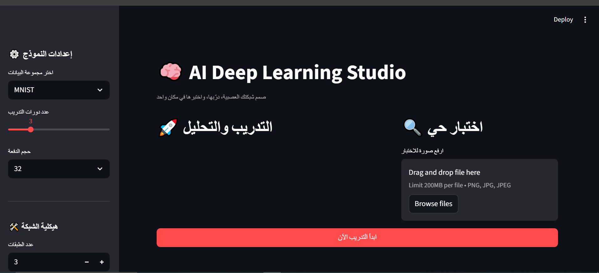

# 🧠 AI Deep Learning Studio (CNN Builder)

## 🚀 Project Overview
An interactive web application built with **Streamlit** and **TensorFlow** that allows users to design, configure, and train Convolutional Neural Networks (CNN) directly from the browser. 

## 🛠️ Technical Features:
- **Dynamic Architecture:** Users can define the number of layers, filters, and activation functions.
- **Built-in Datasets:** Supports MNIST, CIFAR10, and Fashion-MNIST.
- **Real-time Analytics:** Visualizes training accuracy and loss curves.
- **Live Inference:** Upload any image to test the trained model instantly.

## 💻 Tech Stack:
- **Python**, **Streamlit**, **TensorFlow/Keras**, **NumPy**, **Pillow**.
